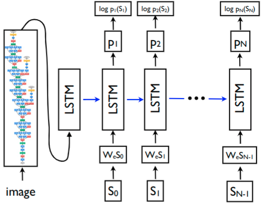

# Show and Tell
###### Noah Himed

### Summary

An implementation of the AI presented in the 2015 paper 
[Show and Tell: A Neural Image Caption Generator](https://arxiv.org/abs/1411.4555v2),
included here for convenience as the file `show_and_tell.pdf`.

The paper details a network that allows autonomous image captioning.

### Implementation

We use PyTorch and Torchvision to implement the following model architecture.
Out of convenience, we use the ResNet50 CNN with pretrained weights.

